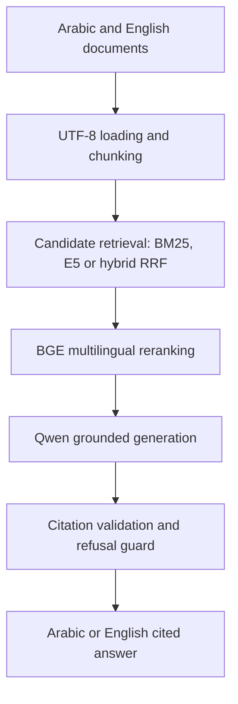

# Arabic–English Enterprise RAG Copilot

[](https://www.python.org/)
[](https://github.com/Rinosa123/Bilingual-Enterprise-RAG-Copilot/actions/workflows/tests.yml)
[](#key-capabilities)
[](LICENSE)

A bilingual enterprise Retrieval-Augmented Generation system that retrieves Arabic and English documents, reranks multilingual evidence, generates grounded answers, validates citations and safely refuses unsupported questions.

[](https://colab.research.google.com/github/Rinosa123/Bilingual-Enterprise-RAG-Copilot/blob/main/notebooks/05_end_to_end_rag.ipynb)

> Portfolio engineering prototype demonstrating multilingual retrieval, cross-language reranking, grounded generation, citation safety and evaluation.

## Why This Project?

Enterprise information is often distributed across documents written in different languages. A user may ask a question in Arabic while the best supporting evidence exists only in English—or the reverse.

This project demonstrates an Arabic–English RAG workflow that can:

* Accept questions in Arabic or English.
* Search across documents in both languages.
* Retrieve evidence across languages.
* Rerank candidate passages using a multilingual cross-encoder.
* Answer in the same language as the question.
* Attach evidence-backed chunk citations.
* Reject unsupported citations.
* Refuse questions when sufficient evidence is unavailable.
* Report retrieval, reranking, generation and total latency.

## Key Capabilities

* UTF-8 Arabic and English document ingestion
* Metadata-preserving document chunking
* BM25 keyword retrieval
* Multilingual E5 dense retrieval
* Reciprocal Rank Fusion for hybrid retrieval
* BGE multilingual cross-encoder reranking
* Arabic and English grounded generation with Qwen
* Same-language answer generation
* Inline chunk-level citations
* Citation allow-list validation
* Localized safe-refusal responses
* Component-level latency measurement
* Dependency-injected pipeline architecture
* Automated unit tests for safety and pipeline behaviour

## Architecture



Detailed design: [System architecture](docs/architecture.md)

## Technology Stack

| Layer                  | Technology                            |
| ---------------------- | ------------------------------------- |
| Language               | Python                                |
| Keyword retrieval      | BM25                                  |
| Dense retrieval        | `intfloat/multilingual-e5-small`      |
| Hybrid fusion          | Reciprocal Rank Fusion                |
| Reranking              | `BAAI/bge-reranker-v2-m3`             |
| Generation             | `Qwen/Qwen3-4B-Instruct-2507`         |
| Quantization           | 4-bit NF4 with BitsAndBytes           |
| ML framework           | PyTorch and Hugging Face Transformers |
| Experiment environment | Google Colab with Tesla T4            |
| Local development      | VS Code on Windows                    |
| Testing                | Python `unittest`                     |

## Demonstration Data

The repository contains two synthetic employee-policy documents:

* One English policy document
* One Arabic policy document

They are divided into ten metadata-rich chunks:

* Five English chunks
* Five Arabic chunks

No confidential or real employee information is included.

## Experimental Results

### Retrieval Benchmark

The following results were obtained from the focused four-question bilingual demonstration benchmark.

| Retrieval method  | Top-1 accuracy |    Hit@3 |        MRR |
| ----------------- | -------------: | -------: | ---------: |
| BM25              |            50% |      50% |     0.5000 |
| Multilingual E5   |            75% |      75% |     0.8125 |
| Hybrid RRF        |            50% |      50% |     0.6125 |
| E5 + BGE reranker |       **100%** | **100%** | **1.0000** |

The tiny benchmark also provides an honest example of why retrieval components must be evaluated: untuned hybrid fusion did not outperform dense retrieval on this dataset.

### Cross-Language Retrieval

For an Arabic annual-leave question whose correct evidence was written in English:

* Dense retrieval position: **rank 4**
* Position after BGE reranking: **rank 1**
* Correct evidence: `HR-EN-001-CH-003`
* Reranker score: `0.9795`

The pipeline then generated an Arabic answer supported by the English evidence.

### End-to-End Evaluation

Five functional scenarios were evaluated:

| Scenario                               | Result |
| -------------------------------------- | ------ |
| English question with English evidence | Passed |
| Arabic question with Arabic evidence   | Passed |
| Arabic question with English evidence  | Passed |
| Unsupported English question           | Passed |
| Unsupported Arabic question            | Passed |

**End-to-end checks passed: 5/5**

Every evaluated response passed:

* Answer-language validation
* Expected content or refusal validation
* Citation-policy validation
* Unsupported-citation detection

### Median Latency

Measured on a Google Colab Tesla T4:

| Pipeline component | Median latency |
| ------------------ | -------------: |
| Dense retrieval    |       11.06 ms |
| BGE reranking      |       16.10 ms |
| Qwen generation    |    4,366.58 ms |
| Complete pipeline  |    4,393.57 ms |

Generation dominates the overall response time. Model loading and the first inference may take longer because of cold-start overhead.

## Example

### Question

```text
How many annual leave days do full-time employees receive?
```

### Grounded Answer

```text
Full-time employees receive 24 working days of annual leave after
completing one year of service [HR-EN-001-CH-003].
```

### Arabic Question Using English Evidence

```text
كم عدد أيام الإجازة السنوية للموظف؟
```

```text
يُمنح الموظف 24 يومًا عملًا من الإجازة السنوية بعد إكمال سنة خدمة
[HR-EN-001-CH-003].
```

### Unsupported Question

```text
What is the company's maternity leave policy?
```

```text
I could not find sufficient evidence in the provided documents to
answer this question.
```

## Citation Safety

The pipeline extracts every generated chunk citation and validates it against the evidence supplied to the generation model.

The answer is blocked and replaced with a localized refusal when:

* A factual answer contains no citation.
* A citation references a chunk outside the supplied evidence.
* Retrieval returns no chunks.
* The model produces an unsupported answer.
* The answer does not follow the configured evidence policy.

Citation-free responses are allowed only for predefined refusal messages.

## Notebooks

| Notebook                                | Purpose                                           | Colab                                                                                                                                                 |
| --------------------------------------- | ------------------------------------------------- | ----------------------------------------------------------------------------------------------------------------------------------------------------- |
| `01_multilingual_dense_retrieval.ipynb` | Evaluate multilingual E5 retrieval                | [Open](https://colab.research.google.com/github/Rinosa123/Bilingual-Enterprise-RAG-Copilot/blob/main/notebooks/01_multilingual_dense_retrieval.ipynb) |
| `02_hybrid_retrieval.ipynb`             | Compare BM25, dense retrieval and hybrid RRF      | [Open](https://colab.research.google.com/github/Rinosa123/Bilingual-Enterprise-RAG-Copilot/blob/main/notebooks/02_hybrid_retrieval.ipynb)             |
| `03_multilingual_reranking.ipynb`       | Evaluate BGE cross-encoder reranking              | [Open](https://colab.research.google.com/github/Rinosa123/Bilingual-Enterprise-RAG-Copilot/blob/main/notebooks/03_multilingual_reranking.ipynb)       |
| `04_grounded_generation.ipynb`          | Test bilingual generation, citations and refusals | [Open](https://colab.research.google.com/github/Rinosa123/Bilingual-Enterprise-RAG-Copilot/blob/main/notebooks/04_grounded_generation.ipynb)          |
| `05_end_to_end_rag.ipynb`               | Run and evaluate the complete RAG pipeline        | [Open](https://colab.research.google.com/github/Rinosa123/Bilingual-Enterprise-RAG-Copilot/blob/main/notebooks/05_end_to_end_rag.ipynb)               |

The end-to-end notebook is the recommended starting point.

## Repository Structure

```text
Bilingual-Enterprise-RAG-Copilot/
├── app/                  # Application interfaces
├── configs/              # Project configuration
├── data/
│   ├── raw/              # Raw source documents
│   ├── processed/        # Generated chunk artifacts
│   └── sample_docs/      # Synthetic Arabic and English documents
├── docs/                 # Architecture and technical documentation
├── notebooks/            # Colab experiments and evaluations
├── scripts/              # Inspection and evaluation commands
├── src/
│   ├── generation/       # Prompt building and citation validation
│   ├── ingestion/        # Document loading and chunking
│   ├── pipeline/         # End-to-end RAG orchestration
│   └── retrieval/        # BM25 and hybrid retrieval
├── tests/                # Automated unit tests
├── requirements.txt
└── requirements-dev.txt
```

## Quick Start

### 1. Clone the Repository

```bash
git clone https://github.com/Rinosa123/Bilingual-Enterprise-RAG-Copilot.git
cd Bilingual-Enterprise-RAG-Copilot
```

### 2. Create a Virtual Environment

Windows PowerShell:

```powershell
python -m venv .venv
.\.venv\Scripts\Activate.ps1
python -m pip install --upgrade pip
```

macOS or Linux:

```bash
python3 -m venv .venv
source .venv/bin/activate
python -m pip install --upgrade pip
```

### 3. Install Dependencies

```bash
pip install -r requirements.txt
```

For development tools:

```bash
pip install -r requirements-dev.txt
```

### 4. Inspect the Documents

```bash
python -m scripts.inspect_documents
```

### 5. Build the Chunks

```bash
python -m scripts.build_chunks
```

### 6. Evaluate the BM25 Baseline

```bash
python -m scripts.evaluate_bm25
```

For GPU-based dense retrieval, reranking and generation, use the supplied Colab notebooks.

## Testing

Run the complete local test suite:

```bash
python -m unittest discover -s tests -v
```

Current result:

```text
Ran 29 tests
OK
```

The tests cover:

* Reciprocal Rank Fusion
* Duplicate ranking handling
* Invalid fusion parameters
* Arabic and English prompt construction
* Language detection
* Evidence formatting
* Empty-evidence handling
* Localized refusal responses
* Citation extraction and validation
* Unsupported-citation blocking
* Reranked evidence ordering
* End-to-end pipeline safety behaviour

## Reproducibility

The experiment notebooks record:

* Python and library versions
* GPU availability and model device
* Model names
* Embedding dimensions
* Candidate and evidence limits
* Retrieval rankings
* Reranker scores
* Generated answers
* Citation-validation results
* Component and total latency

The end-to-end experiment was validated with:

* Python 3.12.13
* PyTorch 2.11.0 with CUDA 12.8
* Transformers 4.57.6
* Sentence Transformers 5.6.0
* BitsAndBytes 0.50.0
* Tesla T4 GPU

## Limitations

This repository is a focused portfolio prototype, not a deployed production system.

Current limitations include:

* Two synthetic documents and ten chunks
* A five-question end-to-end functional evaluation
* Text-file ingestion only
* In-memory dense embeddings
* No authentication or document-level access control
* No tenant isolation
* No persistent vector database
* Citation validation checks chunk IDs, not complete semantic entailment
* GPU-dependent reranking and generation
* Latency varies by hardware and model cold-start state

The reported 5/5 result demonstrates expected behaviour on the included checks and must not be interpreted as general production accuracy.

## Roadmap

* Expand the bilingual evaluation dataset
* Add PDF and DOCX ingestion
* Add persistent vector storage
* Tune hybrid-fusion weights
* Add automated groundedness and faithfulness evaluation
* Add adversarial and prompt-injection tests
* Add document-level access control
* Build a FastAPI service
* Build a Streamlit demonstration interface
* Add Docker packaging
* Add GitHub Actions continuous integration
* Add monitoring and experiment tracking

## Responsible Use

This project uses synthetic policy documents for demonstration. Any production deployment would require:

* Data-governance review
* Privacy and security controls
* User authentication
* Document-level permissions
* Human review for high-impact decisions
* Continuous quality and safety monitoring

The external models used by the notebooks remain subject to their respective licenses and terms.

## License

This project is released under the [MIT License](LICENSE).
