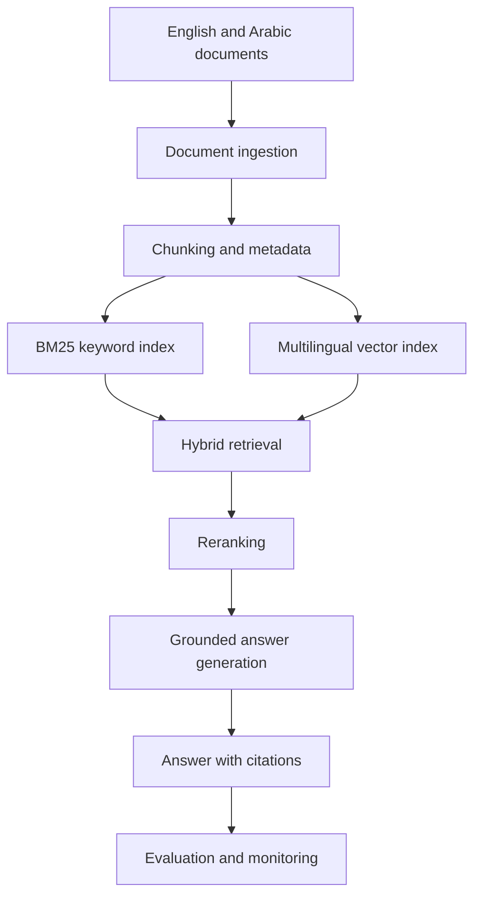

# System Architecture

The Bilingual Enterprise RAG Copilot retrieves information from English and Arabic enterprise documents and generates grounded answers with citations.

## Required Behaviour

- Accept questions in English or Arabic.
- Answer in the same language as the question.
- Generate answers using retrieved documents only.
- Display the document ID and source section.
- Refuse to invent information when evidence is unavailable.
- Protect sensitive configuration and API credentials.
- Record retrieval accuracy, answer quality and response time. 